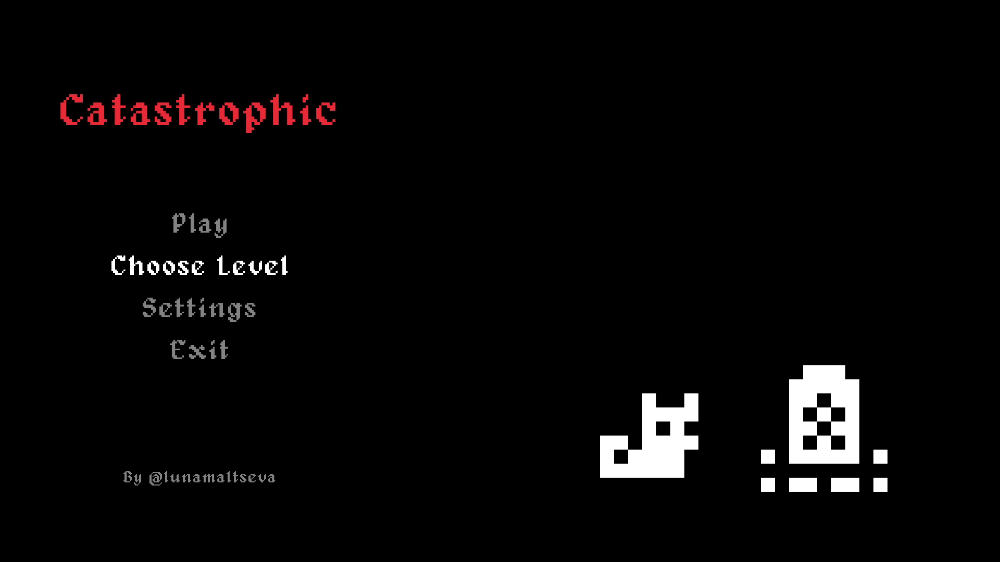

<h1 align=center> COM-119 2024S Project 01: Catastrophic </h1>

This is a translation of [simple-sokoban-project](https://github.com/toksaitov/simple-sokoban-project) into Object-Oriented Programming. This edition fulfills the assignment requirements as well as adding a modular UI system, storytelling, advanced controls, and atmosphere to the base game.

**Catastrophic** is a post-plague dystopian puzzle game that features an undertaker and their cat—the latter continues her owner's work after the owner dies. **Catastrophic** features three levels, the cat advances further and further from home with every level. Depending on how exhausted the cat is by the end, she might find peace from the loss of a beloved one. Your playstyle matters: it is on you whether the cat survives or dies.

<h2 align=center> Additions </h2>

### Main Menu

- Remade the main menu design
- Added the ability to select a level to play
- Added configurable controls and options via an option menu
- Added an exit button
- Added a soundtrack

### Gameplay

- Created custom walls for every level
- Changed the floor textures
- Made a GUI system:
  - Candles indicate how many graves on the level are filled by lighting up
  - Blood shows how many moves the cat has made in total. Every 100 steps results in a blood drop
- Added a soundtrack
- Added a post-level menu, where the number of steps and seconds that were taken to complete the level
- Added a tutorial for first-time players on the first level
- Added sounds to indicate actions
- Added the ability to hold controls down and a priority system for selecting controls
- Added the ability to undo accidental moves and pushes
- Added an exit to the main menu from the pause menu

### Story
- Game launches and plays 4 slides
- Depending on the amount of blood lost, the game plays either the good ending slides or the bad ending slides
---

 

<h4 align=center> 1'500 lines of code; over a month of daily work. </h4>

 

<h5 align=center> by @lunamaltseva </h5>