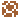

<h1 align=center> COM-119 2024S Project 01: Catastrophic </h1>

<h5 align=center>This is a translation of simple-sokoban-project into OOP</h5>

**Catastrophic** offers a new take on the sokoban genre, providing quality of life improvements as well as enriching the game with the element of story. It narrates the life of an undertaker's cat post a mass epidemic, which wiped out all of humanity; hence, "*Cat***astrophic**". The cat continues its owner's job, seeing to every human gets a proper burial. With every level, the cat wanders futher and further from its home. The end the cat meets depends exclusively on the paths it takes.

<h2 align=center> Features </h2>

##### The Field
The challenge of each level comes from its layout. Each level is made up of `Void`, `Wall`, `Floor`, `Box`, `Goal`, and `Box-on-Goal` tiles. 

| Image | Board | Description |
| :---: | :---: | :--- |
|    | Floor | Tiles that the player can walk over |
| | Void | If any figure steps onto it, it will fall |
|    | Wall | Prevents the player from walking off the floor |
|  | Box | Can be pushed by the player onto a `Floor` or `Goal` tile |
|  | Goal | Acts as a `Floor` tile |
|  | Box on Goal | Retains all the qualities of the `Box` tile |

##### The Mechanics

In Sokoban, the level is completed when all the `Box`es are put on `Goal`s. As a Quality of Life improvement, the amount of `Box`es on `Goal`s, as well as the remaining `Box`es are displayed with lit and unlit candles at the bottom of the screen.

The original Sokoban does not merit neither the picked route nor the time taken to complete the level--this one does. For every 100 steps the `Player` makes, a droplet of blood appears at the bottom of the screen. Who knows, what could happen if the `Player` lost, say, more than 12 of those?

Additionally, the original game gave no room for error. Running a `Box` into a `Wall` meant that only a restart could help. `Catastrophic`, however, allows players to undo their movements with the `U` key.

By the way, when the cat moves, it changes direction.

| Image | GUI element | Description | 
| :---: | :---: | :--- | 
|   | Candles | Serves as an indicator of the amount of `Box on Goal`s compared to `Goal`s in total |
|  | Blood | Equates to a 100 steps per 1 droplet |

<h3 align=center> The Element of Story </h3>

Where **Border Line** was mystical and one-sided, **Catastrophic** secretes hopeful melancholy. **Catastrophic** possesses only three slideshows, dedicating them to the intro, the good ending, and the bad ending. During the intro, the player is eased in to the story of a post-apocalyptic world with a cat without its beloved owner. In the good ending, the cat wanders off out into the open, where the owner finds the cat--hurt, but nevertheless alive. In the bad ending, the owner finds the freshly dead corpse of the cat.

<h3 align=center> Enhancing User Experience with Excellent UI </h3>

##### The Innovation of Object Inheritance

Most of the time developing **Catostrophic** was spent on creating a system of classes that would easily allow integration of additional content. Everything from Text, Levels, and Player, to Slideshows, Prompts, and Menus puts OOP into utility. Every level of complexity puts its precursors into use: The on-screen Prompts utilize Multiline Text, which in turn use regular Text. Considering the time spent on OOP elements, there remains one question, "Why didn't I use them more???"`

##### Intro

The intro of the game is taken up by a slideshow of 4 slides. It can be skipped by pressing `Esc` || `Enter` || `E` || `Q`, moving directly to the `Main Menu`.

##### The Main Menu Screen

The Main Menu screen acts as a hub to the game. **The player can move between options in all menus using `W A S D` or `arrows`. Selecting an item is done by `Enter`. Going back is done through `Esc`.** From it, the player can choose to `Play`, which will launch the game into the first level; additionally, they can choose to `Load (a specific) Level`, or change the `Controls`. The player can also choose to `Quit the game`.

##### The Game Screen

Please see instructions above for a detailed overview of the game. The player can move the `Player Pawn` with `W A S D` or `Arrows`.

##### The Pause Screen

The player can enter and quit the `Pause screen` by pressing `Esc`. The `Pause Screen` provides options to resume the game, restart the level, exit to main menu, and quit the game. Restarting the level fully reloads the level and all elements, including steps taken.

##### The Endings

The `Ending` occurs by the end of `Level 3`. Depending on whether the player has exceeded 1200 steps, they will be served the good or the bad ending

---

 

<h4 align=center> 1'500 lines of code; over a month of daily work. </h4>

 

<h5 align=center> by @lunamaltseva </h5>